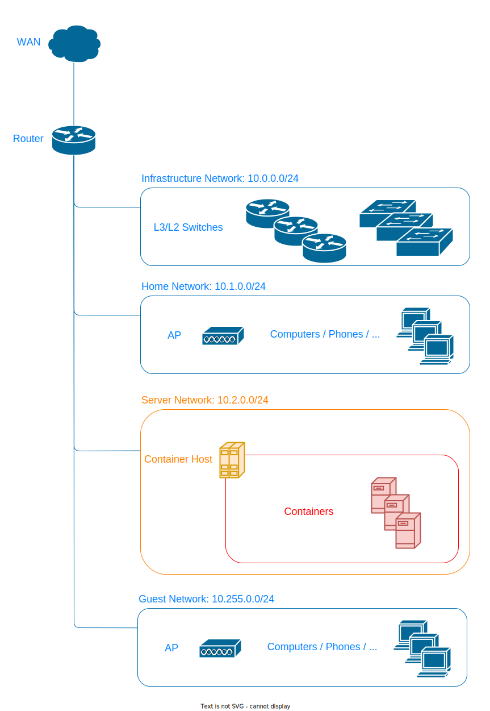

# Overview

# Network Design

A network are devided several segments.

## Infrastructure Network (10.0.0.0/24)

- for managing L3/L2 switches(VLAN/Link Aggregation/...)

### IP Addresses

Default Gateway: `10.0.0.254/24`

| Segments | # | Hosts |
| ---- | -- | -------- |
| 10.0.0.0/24 | 0 | - |
|  | 1 | L2 Switch |
|  | ... |  |
|  | 254 | L3 Switch |
|  | 255 | - |

## Home Network (10.1.0.0/24)

- for home devices
- to operate servers/switches over segments, add routes for infrastructure/server network

### IP Addresses

Default Gateway: `10.1.0.254/24`

| Segments | # | Hosts |
| ---- | -- | -------- |
| 10.1.0.0/24 | 0 | - |
|  | ... |  |
|  | 64-191 | DHCP |
|  | ... |  |
|  | 253 | Access Point |
|  | 254 | L3 Switch |
|  | 255 | - |

## Server Network (10.2.0.0/24)

- for servers
- 10.2.0.0/16 - 10.254.0.0/16 are allocated for scaling

### IP Addresses

Default Gateway: `10.2.0.254/24`

| Segments | # | Hosts |
| ---- | -- | -------- |
| 10.2.0.0/24 | 0 | - |
|  | ... |  |
|  | 10 | Container Host |
|  | ... |  |
|  | 254 | L3 Switch |
|  | 255 | - |

## Guest Network (10.255.0.0/24)

- for guests
- isolated from other segments

### IP Addresses

Default Gateway: `10.255.0.254/24`

| Segments | # | Hosts |
| ---- | -- | -------- |
| 10.255.0.0/24 | 0 | - |
|  | ... |  |
|  | 64-191 | DHCP |
|  | ... |  |
|  | 253 | Access Point |
|  | 254 | L3 Switch |
|  | 255 | - |
